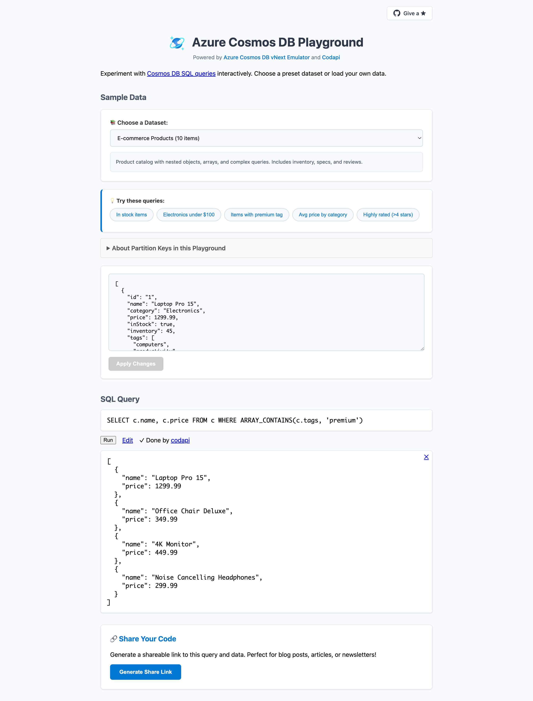

# Azure Cosmos DB Playground

Built with [Azure Cosmos DB vNext emulator](https://learn.microsoft.com/en-us/azure/cosmos-db/emulator-linux) and [Codapi](https://codapi.org/), the Azure Cosmos DB Playground is an interactive, browser-based playground for learning and experimenting with [Azure Cosmos DB SQL queries](https://learn.microsoft.com/en-us/cosmos-db/query/overview) without any setup, installation, or cloud costs.

**Experiment with it https://aka.ms/cosmosdb-playground**

Write queries, load custom data, see results instantly, and generate shareable links to your code. Useful for prototyping, learning, teaching, or embedding interactive examples in documentation and blog posts.

