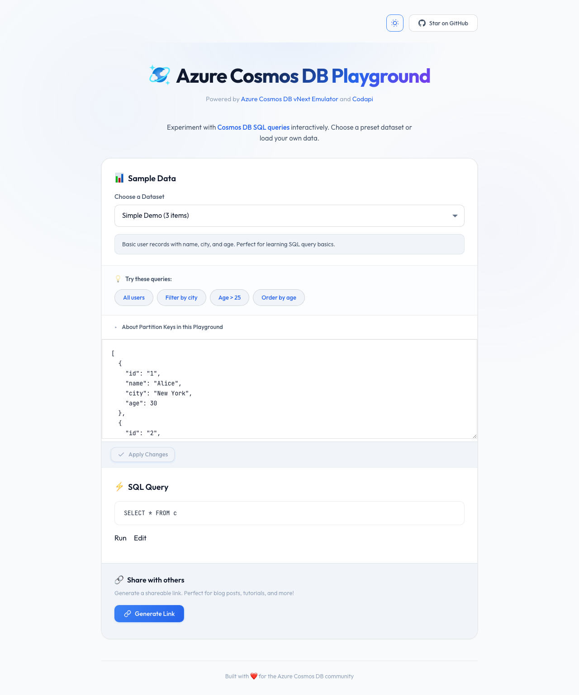
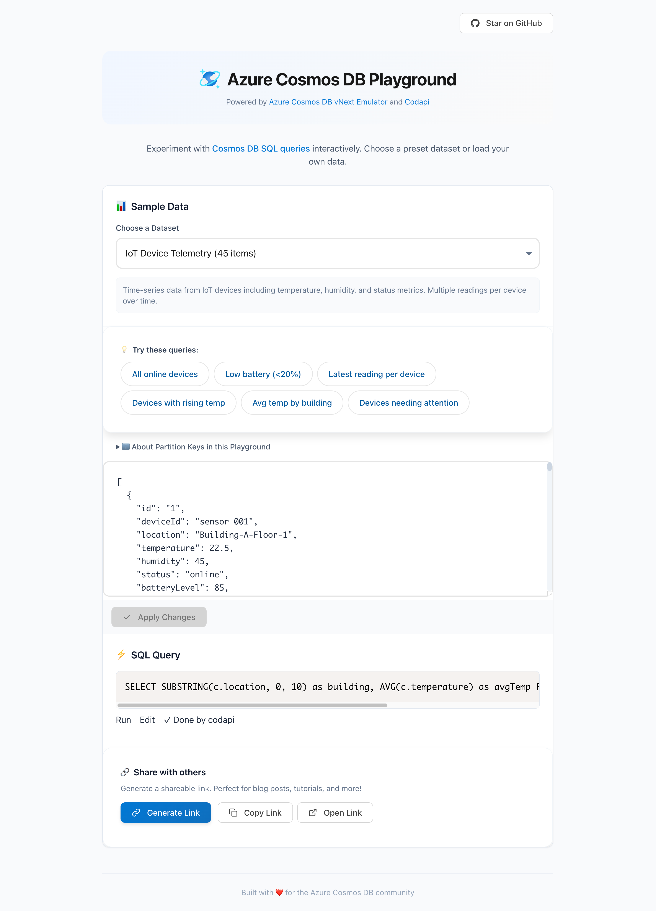

# Azure Cosmos DB Playground 🚀

Built with [Azure Cosmos DB vNext emulator](https://learn.microsoft.com/en-us/azure/cosmos-db/emulator-linux) and [Codapi](https://codapi.org/), the Azure Cosmos DB Playground is an interactive, browser-based playground for learning and experimenting with [Azure Cosmos DB SQL queries](https://learn.microsoft.com/en-us/cosmos-db/query/overview) without any setup, installation, or cloud costs.

🌐 **Access a hosted version on https://aka.ms/cosmosdb-playground**, or deploy your own instance on an Azure VM by following the [deployment instructions](./docs/azure-deployment.md).

▶️ **Quick Demo** (click to play)

📖 **Check out the documentation** for details on [features, architecture]((./docs)), etc.

Useful for prototyping, learning, teaching, and sharing:

- 🔍 Experiment with queries, and see results instantly
- 📦 Use pre-loaded datasets or load your own data
- 🔗 Generate shareable links to your code or embed interactive examples in documentation, blog posts, and tutorials.

⚠️ **Disclaimer:** This is an experimental project and not an official Microsoft or Azure offering. It’s designed for learning and sharing, not for production use.
